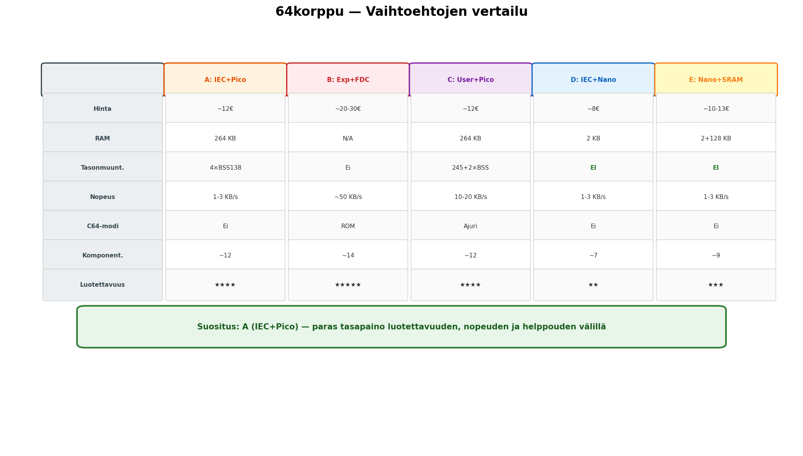

# 64korppu

Standardi PC:n 1.44MB 3.5" HD-korppuasema Commodore 64 -tietokoneeseen. FAT12-levyformaatti mahdollistaa tiedostojen siirron C64:n ja PC:n välillä.

## Vaihtoehdot

| # | Ratkaisu | Liitäntä | Hinta | RAM | Tasonmuuntimet | Suositus |
|---|---|---|---|---|---|---|
| **[A](docs/A-IEC-Pico/)** | **IEC + Raspberry Pi Pico** | IEC-sarjaväylä | ~12€ | 264 KB | 4x BSS138 | **Suositeltu** |
| [B](docs/B-Expansion-FDC/) | Expansion port + FDC-piiri | Expansion port | ~20-30€ | - | Ei | Nopein |
| [C](docs/C-Userport-Pico/) | User port + Raspberry Pi Pico | User port | ~12€ | 264 KB | 1x 74LVC245 + 2x BSS138 | Kompromissi |
| [D](docs/D-IEC-Nano/) | IEC + Arduino Nano | IEC-sarjaväylä | ~8€ | 2 KB | **Ei yhtään** | Halvin |
| [E](docs/E-IEC-Nano-SRAM/) | IEC + Arduino Nano + SPI SRAM | IEC-sarjaväylä | ~10-13€ | 2+128 KB | **Ei yhtään** | Nano tehostettuna |



## Arkkitehtuuri

```
C64 ──[IEC / User port / Expansion port]──> Ohjain ──[34-pin]──> PC 3.5" HD floppy
                                                         │
                                                    FAT12-levy
                                                    (1.44 MB)
                                                         │
                                                    PC lukee/kirjoittaa
                                                    samaa levyä
```

## Miksi?

- **Tiedostonsiirto** C64:n ja modernin PC:n välillä ilman erikoislaitteita
- **FAT12** on universaali — levy toimii molemmissa koneissa
- **.PRG-tiedostot** tallennetaan suoraan levylle (2 tavun load address + data)
- C64:llä: `LOAD "PELI.PRG",8` / `SAVE "OMA.PRG",8` / `LOAD "$",8`

## Projektin rakenne

```
64korppu/
├── docs/
│   ├── A-IEC-Pico/           Vaihtoehto A: IEC + Pico (suositeltu)
│   │   ├── README.md         Yhteenveto
│   │   ├── kuvaus.md         Arkkitehtuuri ja komponentit
│   │   └── piirikaavio.md    Yksityiskohtainen piirikaavio
│   ├── B-Expansion-FDC/      Vaihtoehto B: Expansion port + FDC
│   │   ├── README.md
│   │   ├── kuvaus.md
│   │   └── piirikaavio.md
│   ├── C-Userport-Pico/      Vaihtoehto C: User port + Pico
│   │   ├── README.md
│   │   ├── kuvaus.md
│   │   └── piirikaavio.md
│   ├── D-IEC-Nano/           Vaihtoehto D: IEC + Arduino Nano
│   │   ├── README.md
│   │   ├── kuvaus.md
│   │   └── piirikaavio.md
│   └── E-IEC-Nano-SRAM/      Vaihtoehto E: IEC + Nano + 128KB SRAM
│       ├── README.md
│       ├── kuvaus.md
│       └── piirikaavio.md
└── firmware/                  Pico-firmware (vaihtoehto A)
    ├── CMakeLists.txt
    ├── include/               Header-tiedostot
    │   ├── cbm_dos.h          CBM-DOS-emulaatio
    │   ├── fat12.h            FAT12-tiedostojärjestelmä
    │   ├── floppy_ctrl.h      Floppy-aseman ohjaus
    │   ├── iec_protocol.h     IEC-väyläprotokolla
    │   └── mfm_codec.h        MFM-koodaus/dekoodaus
    ├── src/                   Lähdekoodit
    │   ├── main.c             Pääohjelma, dual-core, inter-core viestit
    │   ├── cbm_dos.c          LOAD/SAVE/$, S:/R:/N:/I: -komennot
    │   ├── fat12.c            FAT12 mount/read/write/delete/format
    │   ├── floppy_ctrl.c      GPIO-ohjaus: moottori, seek, side select
    │   ├── iec_protocol.c     ATN/CLK/DATA bit-bang, byte send/receive
    │   └── mfm_codec.c        MFM-dekoodaus, CRC-CCITT, sektorihaku
    └── pio/                   PIO-ohjelmat (RP2040)
        ├── iec_bus.pio        IEC-vastaanotto
        ├── mfm_read.pio       MFM flux-transitioiden mittaus
        └── mfm_write.pio      MFM flux-transitioiden generointi
```

## Tila

Projekti on suunnitteluvaiheessa. Firmware-koodi on kirjoitettu vaihtoehto A:lle (Pico), mutta ei vielä testattu oikealla laitteistolla.

## Lisenssi

Avoin lähdekoodi. Lisenssi lisätään myöhemmin.
