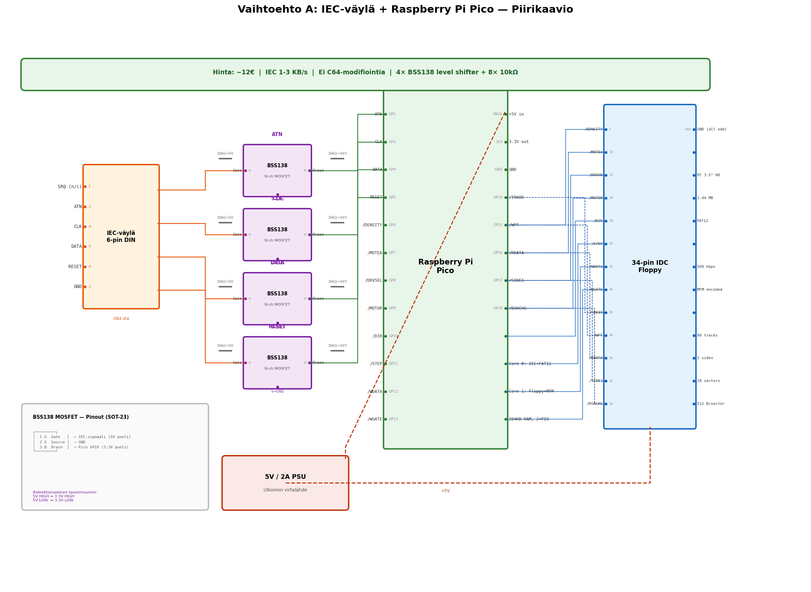

# A: IEC-väylä + Raspberry Pi Pico (Suositeltu)

> C64:n IEC-sarjaväylä → Raspberry Pi Pico → PC 3.5" HD floppy

## Yhteenveto

Pico emuloi CBM-levyasemaa (device #8) IEC-väylällä ja ohjaa PC-korppuasemaa 34-pin Shugart-liitännällä. FAT12-tiedostojärjestelmä mahdollistaa levyjen lukemisen sekä C64:llä että PC:llä.

## Tiedostot

| Tiedosto | Sisältö |
|---|---|
| [kuvaus.md](kuvaus.md) | Arkkitehtuuri, komponenttilista, GPIO-kartta, firmware-rakenne, plussat/miinukset |
| [piirikaavio.md](piirikaavio.md) | Yksityiskohtainen piirikaavio: BSS138 level shifter, floppy-kytkentä, Pico pinout |
| [d64-tuki.md](d64-tuki.md) | D64 disk image -tuki: formaatti, käyttöohjeet, rajoitukset |

## Piirikaavio

## Avainominaisuudet

- **Ei vaadi C64:n modifiointia** — toimii suoraan LOAD/SAVE-komennoilla
- **Dual-core**: IEC-protokolla ja floppy-ohjaus rinnakkain
- **PIO**: tarkka ajoitus MFM-koodaukselle ja IEC-signaloinnille
- **264 KB RAM**: koko raita ja FAT-taulu mahtuvat muistiin
- **D64 disk image -tuki**: kopioi .D64-tiedosto levylle, mounttaa C64:llä `CD:`-komennolla

## Hinta: ~12€

## Haaste

Tarvitsee 4x BSS138 MOSFET level shifter (3.3V ↔ 5V) IEC-väylälle.
