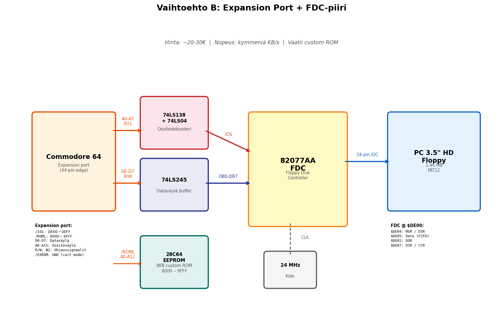

# B: Expansion Port + FDC-piiri (Nopein)

> C64 expansion port → FDC-piiri (82077AA/WD37C65) → PC 3.5" HD floppy

## Yhteenveto

Dedikoidun FDC-piirin (Floppy Disk Controller) avulla saadaan nopein mahdollinen tiedonsiirto. FDC muistimapitetaan C64:n I/O-alueelle $DE00-$DE07 expansion portin kautta. Vaatii custom ROM:in C64-puolelle.

## Tiedostot

| Tiedosto | Sisältö |
|---|---|
| [kuvaus.md](kuvaus.md) | Arkkitehtuuri, FDC-rekisterikartta, osoitedekoodaus, ROM-rakenne |
| [piirikaavio.md](piirikaavio.md) | 74LS138 dekooderi, 74LS245 dataväylä buffer, FDC-kytkentä, 28C64 ROM |

## Piirikaavio

## Avainominaisuudet

- **Nopein vaihtoehto** — FDC hoitaa MFM-koodauksen laitteistotasolla
- **Ei MCU:ta** — puhdas logiikkapiiri-ratkaisu
- **Lähimpänä oikeaa levyohjainta**

## Hinta: ~20-30€

## Haaste

FDC-piirit (82077AA, WD37C65) ovat vanhentuneita ja vaikeasti saatavilla. Monimutkaisin PCB. Vie expansion portin.
