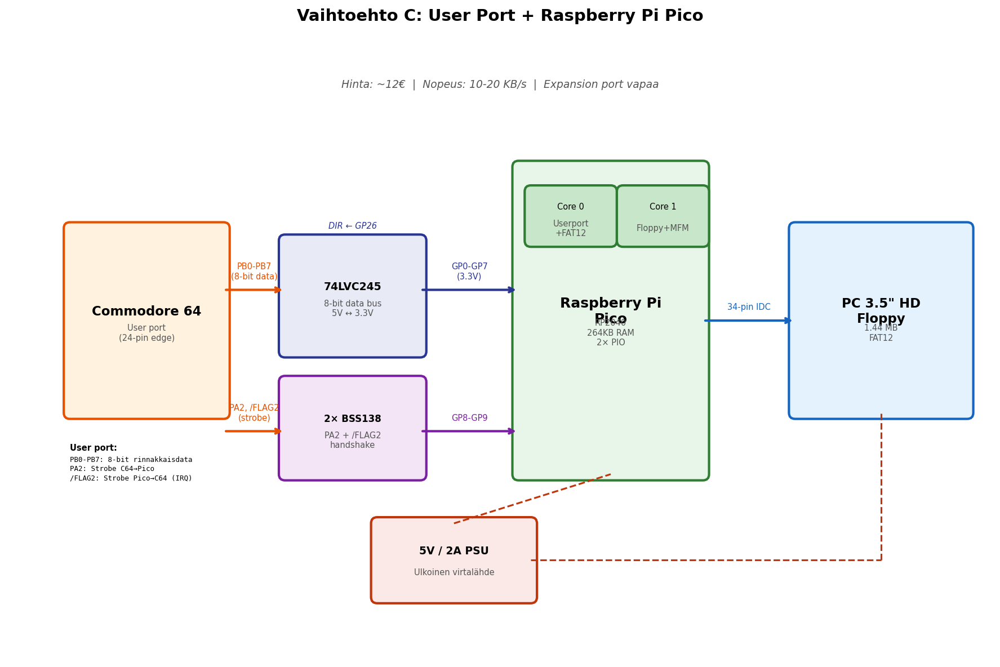

# C: User Port + Raspberry Pi Pico (Hyvä kompromissi)

> C64 user port → Raspberry Pi Pico → PC 3.5" HD floppy

## Yhteenveto

Pico kommunikoi C64:n kanssa user portin 8-bittisen rinnakkaisväylän kautta. Nopeampi kuin IEC (~10-20 KB/s), mutta vaatii ladattavan ajurin C64-puolelle. Expansion port jää vapaaksi.

## Tiedostot

| Tiedosto | Sisältö |
|---|---|
| [kuvaus.md](kuvaus.md) | Arkkitehtuuri, user port protokolla, CIA2-kytkennät, C64-ajurikoodi |
| [piirikaavio.md](piirikaavio.md) | 74LVC245 dataväylä, BSS138 handshake, floppy-kytkentä, DIR-ohjaus |

## Piirikaavio

## Avainominaisuudet

- **Nopeampi kuin IEC** — 8-bittinen rinnakkaissiirto (~10-20 KB/s)
- **Expansion port vapaa** — cartridget ja REU toimivat
- **Dual-core**: sama Pico-etu kuin vaihtoehdossa A

## Hinta: ~12€

## Haaste

Vaatii C64-ajurin lataamisen ennen käyttöä. Ei suoraan yhteensopiva kaiken ohjelmiston kanssa. User port varattu.
