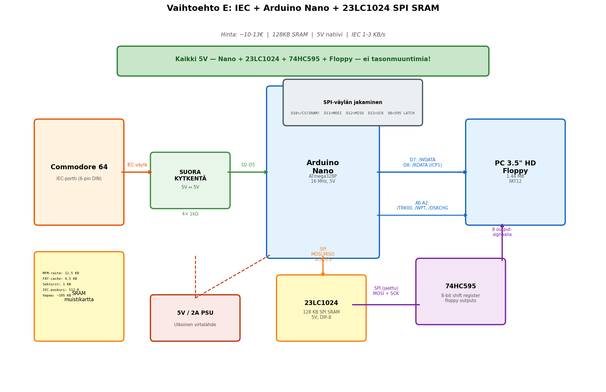

# E: IEC-väylä + Arduino Nano + SPI SRAM (Nano tehostettuna)

> C64:n IEC-sarjaväylä → Arduino Nano + 23LC1024 SRAM → PC 3.5" HD floppy

## Yhteenveto

Vaihtoehto D:n parannettu versio. Microchipin 23LC1024 SPI SRAM (128 KB) ratkaisee Nanon 2 KB muistirajoituksen. 74HC595 shift register ohjaa floppy-signaaleja SPI-väylän kautta, vapauttaen GPIO-pinnejä. Edelleen täysin 5V-natiivi — ei tasonmuuntimia.

## Tiedostot

| Tiedosto | Sisältö |
|---|---|
| [kuvaus.md](kuvaus.md) | SRAM-vaihtoehdot, muistikartta, SPI-väylän jakaminen, 74HC595-ohjaus, firmware-rakenne |
| [piirikaavio.md](piirikaavio.md) | 23LC1024 + 74HC595 SPI-kytkentä, kokonaispiirikaavio, bypass-kondensaattorit |

## Piirikaavio

## Avainominaisuudet

- **128 KB SRAM** — koko raita, FAT-taulu ja puskurit mahtuvat
- **Ei tasonmuuntimia** — 5V natiivi (Nano + 23LC1024 + 74HC595 + floppy)
- **SPI-väylän jakaminen** — SRAM ja shift register samalla väylällä
- **Edullinen** (~10-13€)

## Hinta: ~10-13€

## Haaste

SPI SRAM lisää hieman latenssia. Single-core (ei rinnakkaista IEC + floppy). 32 KB Flash voi olla tiukka.
