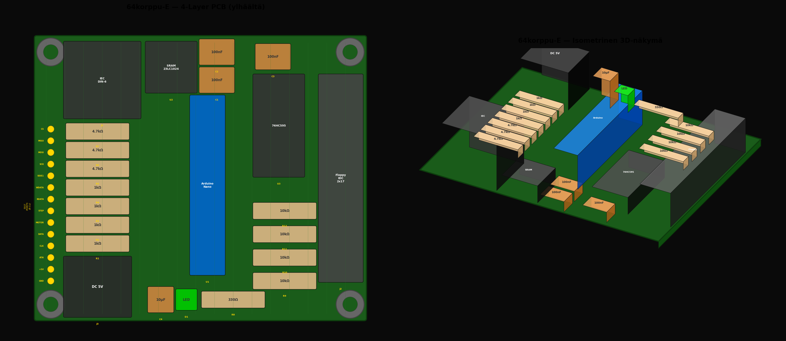

# 64korppu-E — Hardware

> Arduino Nano + 23LC1024 SPI SRAM + 74HC595 — 4-layer PCB

## Variantit

| Kansio | Kuvaus |
|--------|--------|
| [2-layer/](2-layer/) | 2-kerroksinen PCB (F.Cu + B.Cu) |
| [4-layer/](4-layer/) | 4-kerroksinen PCB (F.Cu / GND / +5V / B.Cu) |

## Dokumentaatio

Katso [docs/E-IEC-Nano-SRAM/](../../docs/E-IEC-Nano-SRAM/) — piirikaavio, diagnostiikkapadit, komponenttikuvaus.
