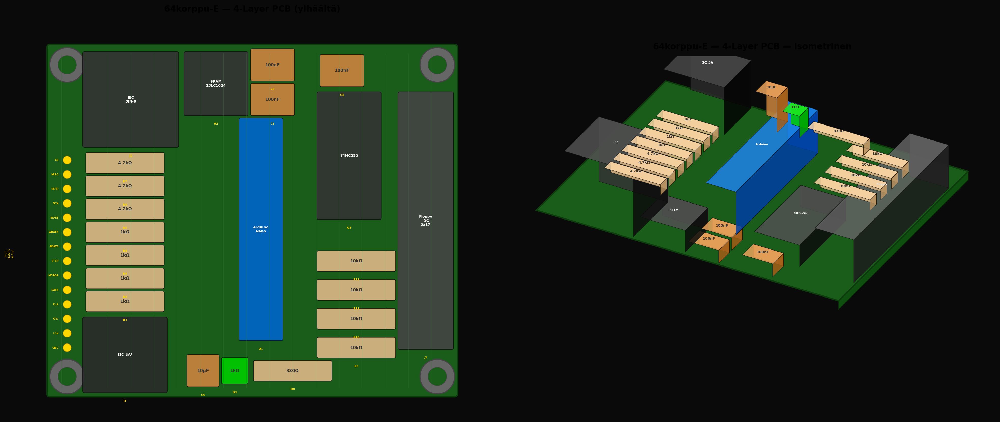
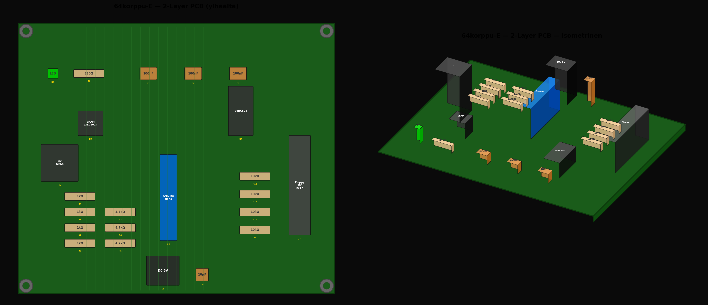

# 64korppu-E — Hardware

> Arduino Nano + 23LC1024 SPI SRAM + 74HC595

## 4-layer (70x60mm)

## 2-layer (140x120mm)

## Variantit

| Kansio | Kerrokset | Mitat (mm) | Pinta-ala |
|--------|-----------|------------|-----------|
| [2-layer/](2-layer/) | F.Cu + B.Cu | 140.0 × 120.0 | 16 800 mm² |
| [4-layer/](4-layer/) | F.Cu / GND / +5V / B.Cu | 70.0 × 60.0 | 4 200 mm² |

## Dokumentaatio

Katso [docs/E-IEC-Nano-SRAM/](../../docs/E-IEC-Nano-SRAM/) — piirikaavio, diagnostiikkapadit, komponenttikuvaus.
